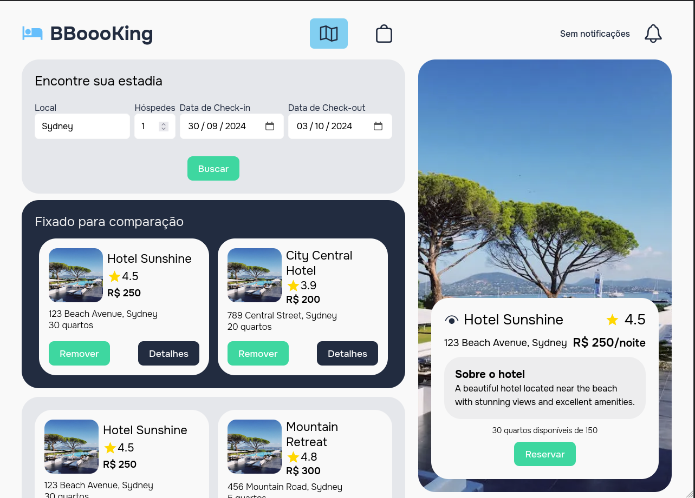
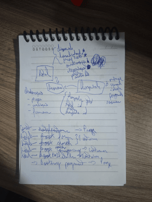

# BBOOOKING

Application for (simulate) hotels bookings.
É uma aplicação para (simular) lidar com reservas de hoteis.



# Goals / Objetivos

- Hotels Seeking / Pesquisa de hotéis
- Comparing options / Comparação de opções
- Book rooms / Reserva de Quartos
- Notification / Notificações

# Characters / Caracteristicas

- Vue 3
- TypeScript, JS with strongly type power
- Bootstrapped with Vue CLI
- Pinia as state management
- Eslint + Prettier for formatting rules and code quality

# Getting started / Para começar

Execute these below commands / Execute os seguintes comandos

```sh
nvm install 18.18
nvm use 18.18
git clone git@github.com:brds15/bboooking
cd bboooking
cp .env.exemple .env # to create env file
npm install # to install dependencies
npm run api:server # to simule server
npm run serve # open localhost
```

# Diary of developing / Diário do desenvolvimento


🇧🇷
### Análise dos Requisitos
Esboço inicial



O primeiro desafio foi analisar os requisitos para a criação deste MVP. Uma técnica que gosto de usar é o DDD (Domain-Driven Design), pois ele define e impõe limites e responsabilidades para cada domínio. Em minhas abstrações, identifiquei os seguintes domínios:
- Hotel
- Hóspede (Guest)
- Reserva (Booking)

### Principais Páginas do Projeto
A partir deste ponto, pude separar as principais páginas do projeto:

#### Hotels
- **HotelsPage**: Página home da aplicação, dedicada para pesquisar, comparar, filtrar e visualizar hotéis.

#### Booking
- **BookPage**: Página dedicada para efetuar a reserva (bem como pagamento).

#### Guest
- **GuestPage**: Página onde o hóspede pode visualizar a sua reserva e notificações sobre a sua própria reserva.

Cada página adota a convenção de usar o sufixo "Page" para identificar de forma rápida e fácil nas importações a que tipo de componente pertence.

### Configuração do Vue Router
Ao configurar o vue-router, foi escolhido usar `WebHashHistory` para facilitar questões de configuração, pois se trata de uma aplicação demo. Na vida real, sei o impacto que isso teria no SEO.

### Design da Aplicação
Para o design da aplicação, adotei o Atomic Design, por ser de fácil entendimento e já bem utilizado em qualquer tipo e tamanho de software. Essa abordagem ajuda a garantir que cada componente tenha responsabilidades limitadas ou únicas, uma boa prática no SOLID.

Com as páginas já definidas e o layout de interface em mente, fica mais claro como serão as divisões entre os componentes.

### Definição dos Alicerces
Todo sistema frontend deve ter seus alicerces bem definidos. Isso significa que os containers pais devem estar, além de bem definidos, claros no código quanto às suas respectivas responsabilidades. Para isso, criei a pasta `layouts` dentro de `components`.

A pasta `layouts` foi definida para ter componentes que compõem um layout padrão do sistema, que são compartilhados independentemente da página. Exemplos incluem:
- Header
- Content
- Footer

### Divisão de Componentes
As demais divisões intercomponentes seguem a divisão do Atomic Design, com algumas diferenças:
- Atoms -> generico para uso generico
- Molecules -> destinado a lógica de produto
- Organisms -> destinado a lógica de produto
- Templates -> destinado a lógica de produto
- Pages -> destinado a lógica de produto

O uso de `molecules` e `organisms` como destinado a lógica de negócio (produto) para ter mais coesão. E também por ser um projeto apenas MVP. Pode ser facilmente realocado para ser generico.

#### Componentes de Médio Nível
Componentes de médio nível (molecules, organisms e templates) seguem a convenção de ter uma pasta com o nome de sua page, caso seja utilizada somente por uma page. Caso sejam multi-compartilhados, independentemente do componente, não utilizam esta convenção. Isso se aplica também aos componentes dentro de `atoms`, que são de nível mais baixo (nativo HTML) e usados por todos os componentes.

### Layout Responsivo
Escolhi apenas um breakpoint para permitir o layout responsivo: 992px. Para diminuir o escopo e abrangência, e com esta medida, os containers já entram numa escala de tela para pequenos monitores e tablets, que podem ter um bom dimensionamento somado a práticas do uso de flex-box e grid-layout.

### Criação do Formulário de Busca de Hotéis
Na criação do formulário para busca de hotéis, foram criados componentes de inputs para que sejam reaproveitados no formulário de reserva de quartos. O estado foi definido como local, pois são parâmetros que vão ser usados para a busca a partir do próprio formulário.

### Gestão de Estado do Formulário
Decidi fazer a gestão de estado no formulário de forma nativa com a estrutura `{campo: {valor, erro}}`, pois já é suficiente para esta aplicação. Zod foi escolhido para realizar o schema handler.

### Página Guest
A página Guest tem como objetivo exibir as notificações do usuário com o template `GuestNotification`. A estrutura de dados foi pensada para ser a mais simples possível, com apenas um array de strings, para que o escopo do software não fique complexo.

### Mock de Dados
Para mockar os dados, foi escolhido o `json-server`, por ser uma lib extremamente simples e que pode ser usada no cliente.

### Estrutura de Pastas para Serviços
Dentro de `services`, foi criada uma estrutura de pastas para lidar com questões de API. A instância foi configurada dentro da pasta `configurations`. Dentro da pasta `mocks`, existe um arquivo `db.json` com os mocks das APIs para integração com o json-server. Cada conjunto de APIs é separado pelo domínio da aplicação e tem um arquivo próprio.

### Utilização do axios
Escolhi utilizar o axios invés de fetch nativo por questão de compatibilidade. Além disso, o axios fornece uma flexibilidade referente a utilização de instâncias, bem como interceptors.  

### Utilização de Then e Catch
Nos componentes, foi preferido utilizar `then` e `catch`, por ser um código mais limpo, já que o axios já retorna uma promise.


## To-do
- utilizar o beforeEnter para alterar o icone selecionado de forma dinamica - atualização prevista 02/08
- preparar script githubactions - atualização prevista 03/08
- criar alguns testes - atualização prevista 03/08
